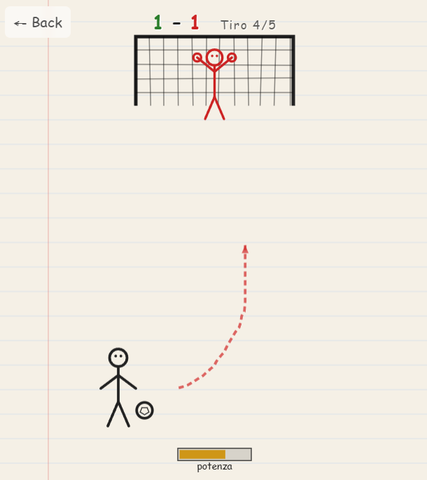

# Stick Penalty

> Un gioco di rigori disegnato a mano — tira con uno swipe, supera la barriera e batti il portiere!

## 🎮 Come si gioca

**Swipe per tirare:** tieni premuto, trascina nella direzione del tiro e rilascia.

- **Direzione** → il punto finale dello swipe indica dove va il pallone
- **Potenza** → più lungo è lo swipe, più forte è il tiro
- **Effetto** → più curvo è il gesto, più il pallone "gira" (tiro a effetto)

Funziona sia con **mouse** (click-drag-release) che con **touch** (tap-swipe-release).

## 📐 Meccaniche

| Swipe | Risultato |
|---|---|
| Corto e dritto | Tiro debole ma preciso |
| Lungo e dritto | Tiro forte e diretto |
| Lungo e curvo | Tiro potente a giro |

## 🧤 Portiere AI

- Resta al centro e legge il tiro al rilascio
- Prova a prevedere la destinazione e si tuffa
- Ha un errore "umano" che varia con la difficoltà
- Si muove solo dentro la porta

## 🧱 Livelli

| Livello | Barriera | Portiere | Gol richiesti |
|---|---|---|---|
| 1 | Nessuna | Facile | 3/5 |
| 2 | 3 omini | Medio | 3/5 |
| 3 | 4 omini | Tosto | 3/5 |
| 4 | 5 omini | Veloce | 4/5 |

Se fai abbastanza gol, avanzi al livello successivo!

## 🎨 Stile visivo

Tutto sembra disegnato da un bambino su un foglio di quaderno: porta, pallone, giocatori, traiettorie rosse "scarabocchiate". Gli omini della barriera hanno una posa a diamante con le braccia aperte.

## 🛠 Tech

- Pure HTML / CSS / Canvas — zero dipendenze
- Touch + Mouse con lo stesso gesto
- Struttura a livelli espandibile (basta aggiungere un oggetto in `LEVELS[]`)

## ▶️ Gioca

[Apri Stick Penalty](index.html)

